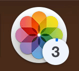

# DockProgress

> Show progress in your app's Dock icon


This package is used in production by the [Gifski app](https://github.com/sindresorhus/gifski-app). You might also like some of my [other apps](https://sindresorhus.com/apps).


## Requirements

- macOS 10.12+
- Xcode 10+
- Swift 4.2+


## Install

#### SwiftPM

```swift
.package(url: "https://github.com/sindresorhus/DockProgress", from: "1.2.0")
```

#### Carthage

```
github "sindresorhus/DockProgress"
```

#### CocoaPods

```ruby
pod 'DockProgress'
```

<a href="https://www.patreon.com/sindresorhus">
	
</a>


## Usage

### Manually set the progress

```swift
import Cocoa
import DockProgress

foo.onUpdate = { progress in
	DockProgress.progressValue = progress
}
```

### Specify a [`Progress`](https://developer.apple.com/documentation/foundation/progress) instance

```swift
import Cocoa
import DockProgress

let progress = Progress(totalUnitCount: 1)
progress?.becomeCurrent(withPendingUnitCount: 1)

DockProgress.progress = progress
```


## Styles

It comes with two styles. PR welcome for more.

Check out the example app in the Xcode project.

You can also draw a custom progress with `.custom(drawHandler: (_ rect: CGRect) -> Void)`.

### Bar


```swift
import DockProgress

DockProgress.style = .bar
```

This is the default.

### Circle


```swift
import DockProgress

DockProgress.style = .circle(radius: 55, color: .systemBlue)
```

Make sure to set a `radius` that matches your app icon.

### Badge



```swift
import DockProgress

DockProgress.style = .badge(color: .systemBlue, badgeValue: { getDownloadCount() })
```

Large `badgeValue` numbers will be written in kilo short notation, for example, `1000` → `1k`.

Note: The `badgeValue` is not meant to be used as a numeric percentage. It's for things like count of downloads, number of files being converted, etc.


## Related

- [Defaults](https://github.com/sindresorhus/Defaults) - Swifty and modern UserDefaults
- [Preferences](https://github.com/sindresorhus/Preferences) - Add a preferences window to your macOS app in minutes
- [LaunchAtLogin](https://github.com/sindresorhus/LaunchAtLogin) - Add "Launch at Login" functionality to your macOS app
- [More…](https://github.com/search?q=user%3Asindresorhus+language%3Aswift)


## License

MIT © [Sindre Sorhus](https://sindresorhus.com)
